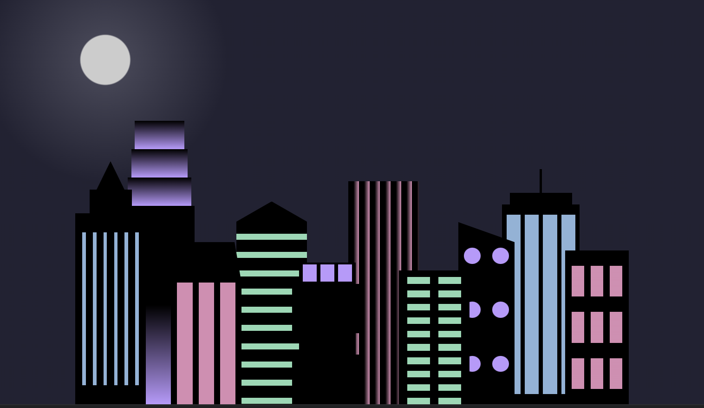

# City Skyline with CSS

## Overview

City Skyline with CSS is a project that demonstrates the creation of a simple skyline scene using HTML and CSS. It showcases various buildings, windows, and background elements to create a visually appealing representation of a city skyline.

## Features

- **CSS Styling:** Utilizes advanced CSS techniques such as gradients, linear and radial backgrounds, flexbox layout, and CSS variables to create the city skyline.
  
- **Building Structures:** Demonstrates the use of CSS to design different types of buildings with varying heights, colors, and window configurations.
  
- **Responsive Design:** The skyline is designed to be responsive and adjusts its layout based on the viewport size, ensuring optimal viewing across different devices.

Here are the results:

